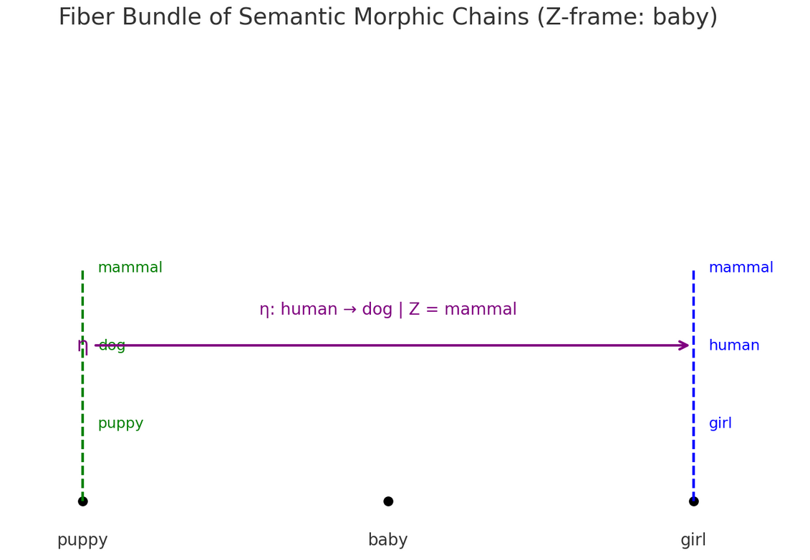

# What is Z and Morphism
We put varible Z as contituity or morphic path. However, we define it as base space using all experiences we obtained so far.

We defined Morphisms using examples, but now we can define it using formulation based on Category Theory and observation we obtained so far.



# Definition of Z
We define a concept A as:

*Fb(A)≅Nat(Hom(−,A),F)*

That is: A concept is understood as a structure of morphisms (Yoneda perspective),
and its semantic fiber Fb​ represents how this concept appears within a Z-frame,which is morphic path, b∈B


**Base Space B: Z-frame**

B is the space of continuity or morphic path
Each element b∈B is a semantic base point such as "baby", "gender", "mammal", etc.
These are not content themselves, but frames along which meanings are structurally preserved.


**Fiber Fb​: Morphic Chain**

For each b∈B, define:
*Fb=π−1(b)*

The fiber over b is the set of morphic chains that are a continuum under Z
π: girl → she → female | femenity


**Total Space E**
The total space of the bundle π:E→B is the space of all conceptual transitions
across all possible Z-frames. Think of it as the union of all fibers.

```
   dog     human     
    |         |        
    |         |        
   puppy     girl    
    |         |        
     \__baby__/
      (base B)

Total space E = The space which includes all of this

```

**Parallel Transport of Meaning**

*η:Fdi→Fdi | Z*
e.g. η: girl → puppy | baby

# What is Morphism in Conceptual Topology
CT has 3 levels of Morphisms.

f: A → B | R
f: A ≈ B | Z_local
f: A ~ B | Z_global

Z: variable which ensures the continuity 
R: rupture

We can redefine this as follows.
η: Fdi→Fdi | R // failure of projection
η: A ≈ B | Z_local
f: A ~ B | Z_global 

This document and all conceptual content therein are © [No Name Yet Exist], 2025. All rights reserved. Unauthorized reproduction, distribution, or use without explicit permission is prohibited.